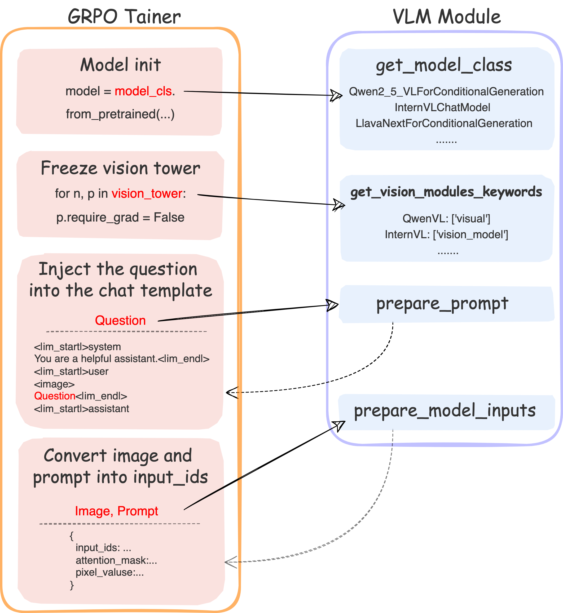

# How to add a new model

## VLM Module

To enhance scalability and ease of integration for new models, we create the [VLM Module class](../src/open-r1-multimodal/src/open_r1/vlm_modules/vlm_module.py). As shown in the figure above, The current **GRPO Trainer**  primarily handles abstract operations, such as "placing the question into the chat template" and "converting the image and prompt into input_ids". The actual implementation is delegated to the **VLM Module**, while the **GRPO Trainer** is responsible solely for calling the exposed function interfaces of the **VLM Module**.

## The implemented function of VLM Module

To add a new model, you need to implement the following functions in the **VLM Module**:
### 1. get_vlm_key
Return the identifier of the model, such as "internvl", "qwen".

### 2. get_model_class
Return the model class of the model that is used to initialize in the `GRPO Trainer`. For "qwen", the model class is `Qwen2_5_VLForConditionalGeneration` or `Qwen2VLForConditionalGeneration`, and for "internvl", the model class is `InternVLChatModel`.

### 3. post_model_init
This function is called after the model and processor are initialized. You can do some post-processing here. Taking "internvl" as an example, we need to record the `conv_template` and `num_image_token` for later use, and set the `img_context_token_id` for the model.

### 4. is_embeds_input
Return whether the model accepts `input_embedding` as input while not `input_ids` when calling `generate` method.

### 5. get_processing_class
Return the processing class of the model. For most models, `AutoProcessor` is typically used.

### 6. get_vision_modules_keywords
Return the keywords of the vision modules of the model. This is used to freeze the vision modules in the `GRPO Trainer`.

### 7. get_custom_multimodal_keywords
Besides `input_ids` and `attention_mask`, the model also accepts some distinct custom multimodal inputs for different VLMs when calling `forward` method, such as `pixel_values` and `image_thw` for "qwen", and `pixel_values` and `image_flags` for "internvl".

### 8. get_non_generate_params
There may be some parameters in the custom multimodal inputs that are not used in the `generate` method, such as `image_flags` for "internvl". You need to return them in the `get_non_generate_params` function.

### 9. get_custom_processing_keywords
Some models may have some specific parameters for the `processing_class`, such as `max_pixels` and `min_pixels` for "qwen", and `max_anyres_num` for "internvl". You need to return them in the `get_custom_processing_keywords` function.

### 10. prepare_prompt
This function is used to place the prompt into the chat template. Different models may have different processing methods, so you need to implement this function according to the model.

### 11. prepare_model_inputs
This function is used to process the image and prompt into the format that the model accepts. The returned value should be a `dict` with the following keys: `input_ids`, `attention_mask`, and the custom multimodal inputs.

#### You could refer to [qwen_module.py](../src/open-r1-multimodal/src/open_r1/vlm_modules/qwen_module.py) and [internvl_module.py](../src/open-r1-multimodal/src/open_r1/vlm_modules/internvl_module.py) for the example implementations of QwenVL and InternVL respectively.

