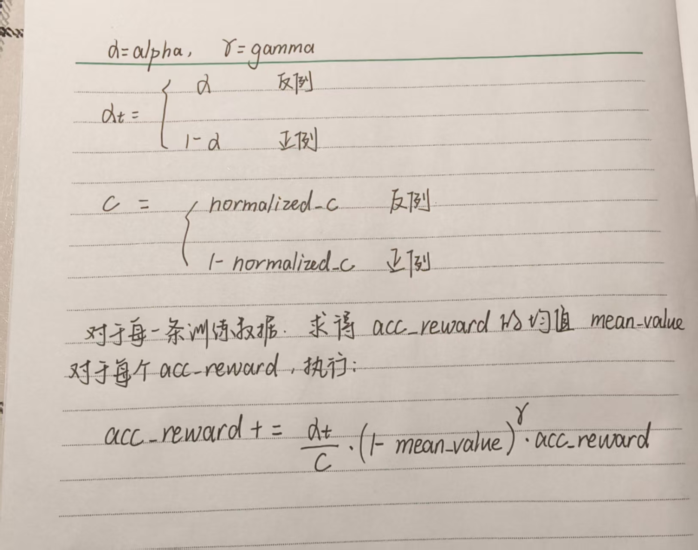

## 更新日志

### 4.11

#### 更新内容

* 增加focal-loss ，因为涉及到从多卡上聚合后计算reward的问题，目前只适用于 nproc-per-node * per_device_train_batch_size % num_generation == 0的情况。focal-loss计算公式：
* 
* 使用focal-loss对v2.1进行训练，目前的参数：normalized_c = 0.031 （归一化参数），gamma = 2 （可调节因子），alpha = 0.056 （反例在数据集中占据的比例）,per_device_train_batch_size=2,nproc-per-node=2,num_generation=4.
* 将focal-loss的参数写进脚本

### 4.22
* 添加正例判断参数positive_word，即正例的答案中一定会出现的字符串
